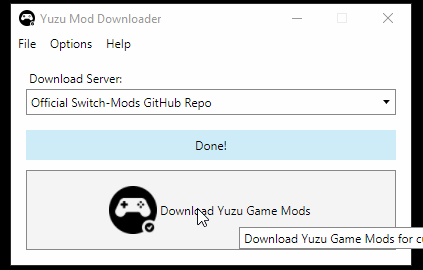
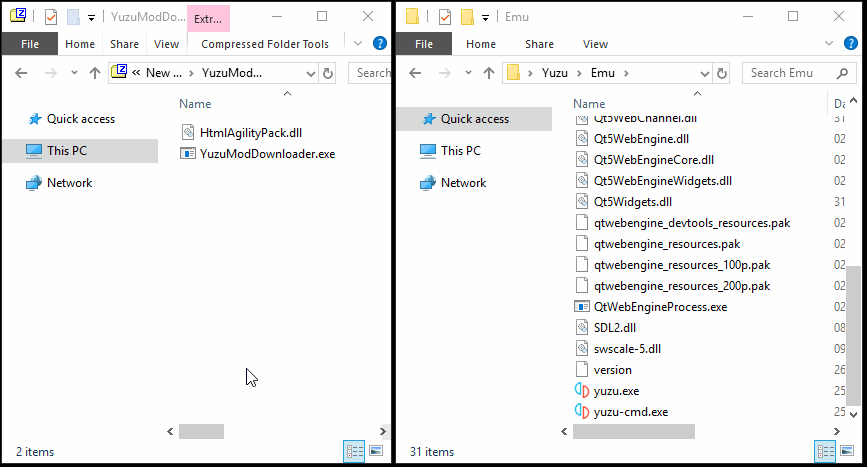
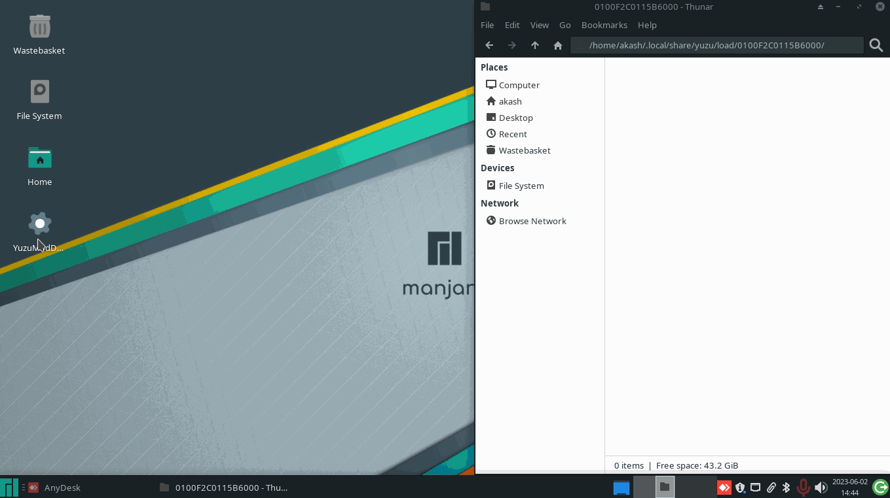
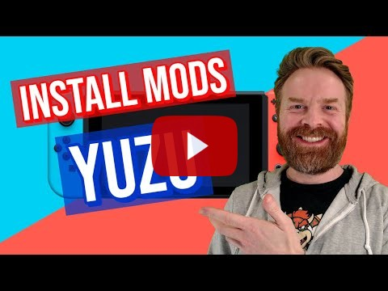

<!--  -->

# Switch Emu Mod Downloader

A Cross-Platform One-Click Games Mod Downloader for Switch emulators. Formerly known as YuzuModDownloader.

Perfect for those who need to download Switch emulation enhancement/workaround mods for their dumped games.

Compatible with both the standalone and installed versions of any Switch emulator.



#### Did this program help you? Please consider buying me a cup of coffee to support my work 

[](https://ko-fi.com/amakvana)
[](https://liberapay.com/amakvana/donate)

## Table of Contents

- [Overview](#overview)
  - [Methodology](#methodology)
  - [Usage](#usage)
- [Download](#downloads)
- [Installation](#installation)
  - [Windows](#windows)
  - [Linux](#linux)
  - [YouTube Tutorial](#installation---youtube-guide)
- [User Guide](https://github.com/amakvana/SwitchEmuModDownloader/blob/main/GUIDE.md)
- [Acknowledgements](#acknowledgements)

## Overview

### Methodology

1. Reads current games imported into your Switch emulator.
2. Reads selected `Download Server`
3. Scans game library to see available mods.
4. Fetches the mod URL's for current games.
5. Downloads & extracts it into the emulators' Mod folder.

### Usage

See [GUIDE](https://github.com/amakvana/SwitchEmuModDownloader/blob/main/GUIDE.md)

https://github.com/amakvana/SwitchEmuModDownloader/blob/main/GUIDE.md

## Downloads

https://github.com/amakvana/SwitchEmuModDownloader/releases/latest

Requires:

- Latest [7-Zip](https://www.7-zip.org/a/7z2301-x64.msi) installed.
- Latest .NET 8 Desktop Runtime for [Windows](https://dotnet.microsoft.com/en-us/download/dotnet/thank-you/runtime-desktop-8.0.1-windows-x64-installer) or [Linux](https://learn.microsoft.com/en-gb/dotnet/core/install/linux?WT.mc_id=dotnet-35129-website) installed.
- Latest [Microsoft Edge Chromium](https://www.microsoft.com/en-us/edge/download) or [Google Chrome](https://www.google.com/chrome/) installed. Linux - deb only.
- Latest [Visual C++ X64 Redistributable](https://aka.ms/vs/16/release/vc_redist.x64.exe) installed.
- Latest [Yuzu](https://yuzu-emu.org/downloads/) installed, setup and [configured](https://youtu.be/kSVlTC1mO9w).

## Installation

SwitchEmuModDownloader does not require Administrator privileges to run.

Refer to the [GUIDE](https://github.com/amakvana/SwitchEmuModDownloader/blob/main/GUIDE.md) for usage instructions.

### Windows

Extract the entire contents of the `YuzuModDownloader-X.X.X.X-Windows-x64.zip` file and place it into the same folder your emulator's executable resides.




### Linux

Extract the entire contents of the `YuzuModDownloader-X.X.X.X-Linux-x64.zip` file onto your desktop then run the following commands within Terminal:

```
cd ~/Desktop
chmod +x YuzuModDownloader
./YuzuModDownloader
```

You can double click on YuzuModDownloader to execute it, once the first two commands above have been ran (3rd is to run it from Terminal).



## Installation - YouTube Guide

[](https://youtu.be/q_2ivWN07Kw)

## Acknowledgements

Special thanks to the following:

- [Former Citrus Fruit-Named Emulator Team](https://web.archive.org/web/20230303133913/https://yuzu-emu.org/) - Former Nintendo Switch Emulator Developers
- [TheBoy181](https://github.com/theboy181/) - [Alternative Mods Download Mirror](https://github.com/theboy181/switch-ptchtxt-mods)
- [HolographicWings](https://github.com/HolographicWings) - [Alternative Mods Download Mirror](https://github.com/HolographicWings/TOTK-Mods-collection)
- [Agus Raharjo](https://www.iconfinder.com/agusraharj) - Icons
- [Mr. Sujano](https://www.youtube.com/watch?v=q_2ivWN07Kw) - YouTube Installation Guide
