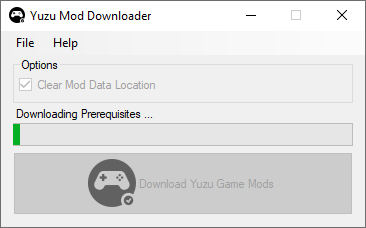
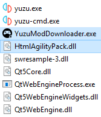

# Yuzu Mod Downloader

A One-Click Yuzu Game Mod downloader for Switch games.

Perfect for those who need to download Switch enhancement/workaround mods from the [Yuzu Switch-Mods Wiki](https://github.com/yuzu-emu/yuzu/wiki/Switch-Mods) for their games.

Compatible with both the standalone and installed versions of Yuzu.

## Overview

### Methodology 
* Reads current games imported into Yuzu.
* Reads https://github.com/yuzu-emu/yuzu/wiki/Switch-Mods
* Scans game library to see available mods.
* Fetches the mod URL's for current games.
* Downloads & extracts it into the Yuzu Mod folder.

### Usage 
See [GUIDE](https://github.com/amakvana/YuzuModDownloader/blob/main/GUIDE.md)

https://github.com/amakvana/YuzuModDownloader/blob/main/GUIDE.md

## Downloads
https://github.com/amakvana/YuzuModDownloader/releases/latest

Requires:
* Latest [Microsoft .NET Framework](https://go.microsoft.com/fwlink/?linkid=2088631).
* Latest [Yuzu](https://yuzu-emu.org/downloads/), setup and [configured](https://www.youtube.com/watch?v=93xsKERji60).
* [Visual C++ 2019 X64 Redistributable](https://aka.ms/vs/16/release/vc_redist.x64.exe).

## Installation
Extract contents of the YuzuModDownloader.zip file into your Yuzu root folder then refer to the [GUIDE](https://github.com/amakvana/YuzuModDownloader/blob/main/GUIDE.md).

YuzuModDownloader does not require Administrator privileges to run.

## Acknowledgements
Thanks:
* [Yuzu Team](https://yuzu-emu.org/) - Nintendo Switch Emulator Developers
* [BSoD Gaming](https://www.youtube.com/channel/UCex2B-k-ZIJhcjRdlYUz4MQ) - Yuzu Setup Guide  
* [Agus Raharjo](https://www.iconfinder.com/agusraharj) - Icons
